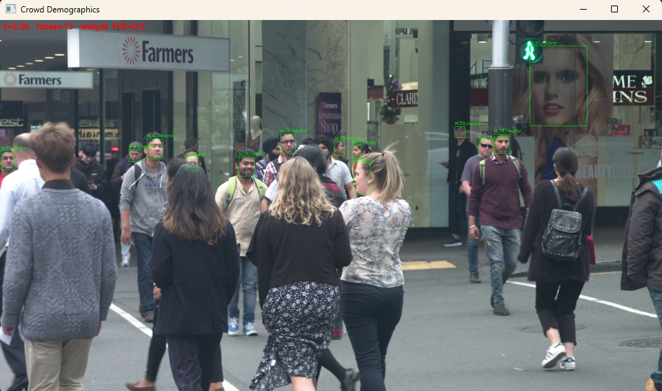
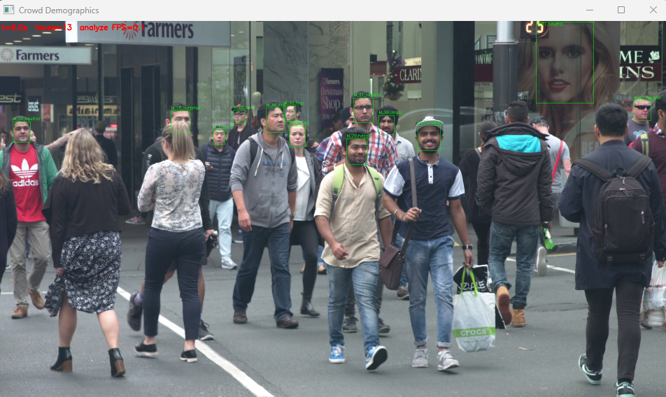

# 군중 인구통계·감정 요약기

`10_Age_Gender Recognition/Emotion_Detection.py`(DeepFace 기반 실시간 age/gender/emotion 표시)를 확장한 개인 프로젝트입니다.

**왜 필요한가**: 행사·매장·강연 같은 공개된 장면 영상 한 편만으로, 그 안의 사람들이 어떤 연령대·성별·감정으로 구성돼 있었는지 한눈에 요약할 수 있습니다.

분석 대상이 처음부터 "나"가 아니라 화면 속 여러 낯선 사람들이라, **공개된(저작권 문제 없는) 군중·관객 영상을 그대로 써도 됩니다.**

## 필수요건 충족 방식

- **요건 1 (3속성 추출)**: `DeepFace.analyze(actions=['age','gender','emotion'])`로 화면 속 모든 얼굴 각각에서 추출
- **요건 2 (감정을 판단에 활용, 핵심)**: 단순 표시가 아니라, 영상 전체에서 감지된 모든 얼굴을 모아 **성별 비율·연령대 분포·감정 분포**로 집계·요약 (`1_analyze_crowd.py`)
- **요건 3 (백엔드 2개 이상 비교)**: 같은 영상을 `opencv`/`retinaface`로 각각 돌려 **프레임당 평균 검출 인원 수**를 비교 (`2_backend_compare.py`) — 군중 영상은 얼굴이 작고 겹쳐 있어서 백엔드에 따라 찾아내는 인원 수 자체가 크게 달라짐
- **요건 4 (실시간 + FPS)**: 영상 재생과 동시에 얼굴 박스·인원수·FPS를 실시간으로 화면에 표시

## 실행 순서

```bash
pip install -r requirements.txt

# videos/ 폴더에 공개 군중·관객 영상을 mp4로 넣기 (Pexels, Pixabay 등 무료 영상 사이트 추천)

# 1. 인구통계·감정 분석 (인자 없으면 videos/ 안의 첫 영상 사용)
python 1_analyze_crowd.py

# 2. 검출 백엔드 비교 (opencv vs retinaface, 같은 영상으로)
python 2_backend_compare.py
```

`1_analyze_crowd.py`를 돌리면:
- 영상이 재생되면서 감지된 모든 얼굴에 박스+나이/성별/감정이 표시되고, 현재 인원수·FPS가 화면에 실시간으로 표시됨
- 종료 후 콘솔에 성별/연령대/감정 분포(%) 출력
- `reports/<영상명>_faces.csv` (얼굴 감지 1건당 1행 원본 로그)와 `reports/<영상명>_summary.png` (성별·연령대·감정 분포 막대그래프 3종) 저장

## 실행 결과

거리 군중 영상(Pexels) 한 편으로 실시간 분석한 화면입니다. 좌상단에 경과 시간·검출 인원수·분석 FPS가 표시됩니다.




오른쪽 위 광고판 속 사람 얼굴까지 검출된 걸 볼 수 있는데, 이건 오탐이 아니라 **진짜 얼굴 사진이라 정상적으로 검출된 것**입니다 — 실제 서비스라면 "포스터/광고 속 얼굴"을 걸러내는 후처리가 추가로 필요하다는 걸 보여주는 사례입니다.

## 주의할 점

- 사람 재식별(re-identification)을 하지 않으므로, 통계는 **"고유 방문자 수"가 아니라 "프레임별 얼굴 감지 건수" 기준**입니다. 같은 사람이 여러 프레임에 걸쳐 계속 잡히면 여러 번 집계됩니다 — 포트폴리오에 결과를 쓸 때 이 한계를 명시하는 게 좋습니다.
- 사람 사진뿐 아니라 **배경 속 광고판·포스터에 인쇄된 얼굴도 검출 대상이 됨** (위 실행 결과 참고)
- `ANALYZE_EVERY_SEC`(기본 1초)를 줄이면 더 촘촘히 분석하지만 그만큼 느려집니다.
- 저작권이 있는 영상(뉴스 클립, 방송 캡처 등)은 피하고, 크리에이티브 커먼즈나 직접 촬영한 공공장소 영상을 사용하세요.

## 파일 구성

```
CrowdDemographics/
├── 1_analyze_crowd.py     # 재생+실시간 분석, 인구통계/감정 집계 리포트+그래프 생성
├── 2_backend_compare.py   # 같은 영상으로 백엔드 2종 검출 인원수·속도 비교
├── videos/                 # 분석할 공개 영상을 여기 넣기
├── docs/images/             # README용 실행 결과 스크린샷
└── reports/
    ├── <영상명>_faces.csv             # 얼굴 감지건별 age/gender/emotion 로그
    ├── <영상명>_summary.png           # 성별·연령대·감정 분포 그래프
    └── <영상명>_backend_compare.csv   # 백엔드별 검출 인원수·속도 비교
```
