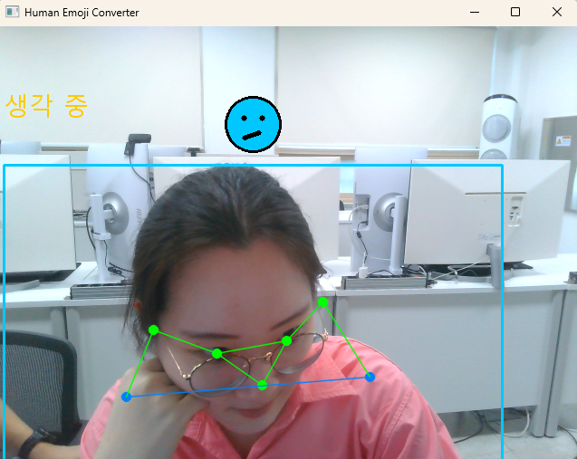
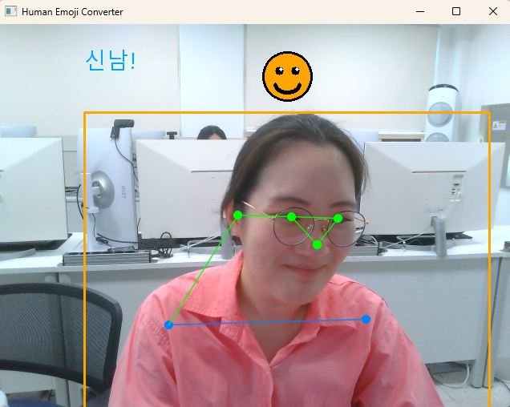
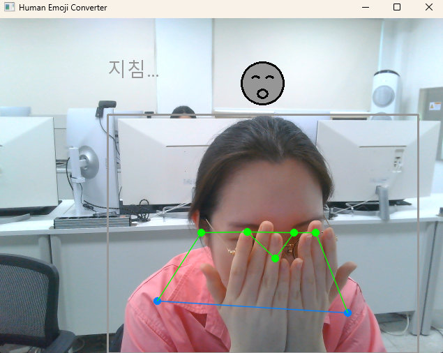

# 인간 이모지 변환기

`06_PoseEstimation`의 YOLO-Pose + XGBoost 파이프라인(13~16번 스크립트)을 그대로 가져와서, 자세를 4가지 "기분"으로 분류하고 실시간으로 이모지 얼굴을 띄워주는 개인 프로젝트입니다.

**왜 필요한가**: 화상수업·스트리밍 중에 마이크를 켜지 않고도 지금 내 상태(생각 중/신남/지침/평온)를 자세만으로 표현할 수 있으면 재미있고 직관적입니다.

## 분류 대상 (앉음·서있음 외 4종)

- `thinking` — 한 손으로 턱을 괴는 자세 (생각 중 🤔)
- `excited` — 양손을 어깨보다 높이 드는 자세, 항복하는 손동작도 OK (신남/놀람 🙌)
- `tired` — 양손으로 얼굴을 가리는 자세 (지침 🥱)
- `neutral` — 특별한 동작 없이 그냥 편하게 앉아있는 자세 (평온 😐)

## 파생 특징 (필수요건: 1개 이상 추가 후 정확도 변화 확인)

`features.py`는 원본 keypoint를 **어깨 중심·어깨 너비 기준으로 정규화**한 좌표 34개에, 아래 3가지 제스처 특징을 더해서 만듭니다. 각 제스처 특징은 정확히 하나의 클래스를 겨냥해서 설계했습니다.

1. **`hand_face_dist_min`** — 두 손목 중 코(얼굴)에 더 가까운 쪽까지의 거리. `thinking`(한 손만 턱에)일 때 작아짐
2. **`hand_face_dist_max`** — 두 손목 중 코에서 더 먼 쪽까지의 거리. `thinking`은 한쪽 손만 가까이 가므로 이 값이 큰 채로 남지만, `tired`(양손으로 얼굴 가리기)는 두 손 다 가까워서 이 값도 작아짐 — **`thinking`과 `tired`를 구분하는 핵심 특징**
3. **`hands_raised`** — 어깨 높이 대비 손목이 얼마나 위에 있는지(두 손 다 올라가야 커지도록 `min` 사용). `excited`(양손 들기)일 때 크게 양수가 됨

가상의 keypoint로 미리 검증해본 결과, 세 자세가 조합적으로 뚜렷하게 구분됐습니다:

| 자세 | hand_face_dist_min | hand_face_dist_max | hands_raised |
|---|---|---|---|
| thinking (한 손만 턱에) | 작음 (0.03) | **큼 (0.45)** | 낮음 |
| tired (양손 얼굴 가리기) | 작음 (0.05) | **작음 (0.05)** | 중간 |
| excited (양손 들기) | 큼 (0.25) | 큼 (0.25) | **높음 (0.25)** |

`3_train.py`가 원본 keypoint만 쓴 모델과, 위 파생 특징 3개를 더한 모델을 각각 학습해서 정확도를 비교·출력합니다.

## 실행 순서

```bash
pip install -r requirements.txt

# 1. 데이터 수집 — 클래스마다 따로 실행 (웹캠 앞에서 해당 자세를 반복)
python 1_collect_pose.py thinking
python 1_collect_pose.py excited
python 1_collect_pose.py tired
python 1_collect_pose.py neutral
# 부족하면 같은 명령을 또 실행해도 됨 (기존 데이터에 이어서 쌓입니다)

# 2. 라벨 붙이기 (pose_img/person/<클래스>/ 폴더 구성을 기준으로 dataset.csv 생성)
python 2_build_dataset.py

# 3. 학습 (원본 vs 파생특징 포함 정확도 비교 출력 + 최종 모델 저장)
python 3_train.py

# 4. 실시간 데모 (웹캠, 감지된 자세에 맞는 이모지 얼굴 + 한글 라벨 표시)
python 4_realtime_demo.py
```

## 실행 결과

| thinking 🤔 | excited 🙌 | tired 🥱 |
|---|---|---|
|  |  |  |

`neutral`(평온 😐)은 별도 캡처 없이, 가만히 앉아있을 때 정상적으로 분류되는 것으로 확인했습니다.

## 겪었던 문제: 카메라 거리가 달라지면 오작동함

`thinking`은 의자를 당겨 가까이서, `excited`/`tired`는 뒤로 밀어 멀리서 찍는 식으로 **클래스마다 카메라와의 거리가 조금씩 달랐던 적이 있습니다.** 처음엔 손-얼굴 거리 같은 파생 특징을 화면 전체 기준 절대 좌표로 계산했는데, 이러면 카메라 거리가 달라질 때마다 같은 동작도 다른 수치로 읽혀서 `thinking`이 실시간 데모에서 잘 안 잡히는 문제가 있었습니다.

**해결**: `features.py`에서 모든 keypoint를 **어깨 중심을 원점(0,0), 어깨 너비를 1로 맞춰 재계산**(정규화)하도록 바꿨습니다. 카메라가 가깝든 멀든 몸이 화면에서 차지하는 비율만 보므로, 촬영 거리가 달라져도 일관되게 동작합니다. 데이터 수집할 때와 실제 사용할 때 거리가 항상 같을 거라고 가정하면 안 된다는 걸 배웠습니다.

## 겪었던 문제: 가만히 있어도 `excited`로 나옴 (버그, 수정함)

손을 전혀 들지 않고 가만히 앉아만 있어도 `excited`(신남)가 뜨는 문제가 있었습니다. 원인은 **YOLO-Pose가 화면 밖으로 나가거나 가려진 keypoint를 `(0,0)`으로 반환**한다는 점이었습니다 — 손을 무릎 위에 내려놓아 카메라 프레임 아래로 벗어나면 손목 좌표가 `(0,0)`이 되는데, 이걸 어깨 중심 기준으로 정규화하면 "어깨보다 한참 위"에 있는 것처럼 계산돼서 `hands_raised` 값이 크게 튀었습니다 (실측: 미검출 시 `+2.25`, 실제로 무릎에 손이 있을 때는 `-1.5`).

**수정**: `features.py`에 `is_missing()` 체크를 추가해서, 손목 좌표가 `(0,0)`이면 "미검출"로 보고 `hand_face_dist`는 확실히 먼 값(100)으로, `hands_raised`는 확실히 안 든 값(-100)으로 고정하도록 했습니다. 사람이 실제로 이미지 맨 왼쪽 위 모서리에 있을 리는 없으니, `(0,0)`은 항상 "안 보임"으로 취급해도 안전합니다.

이 버그를 겪으면서 배운 점: 파생 특징을 설계할 때 "keypoint가 항상 정확히 검출된다"고 가정하면 안 되고, 미검출/가려짐 상황에서 수식이 어떻게 되는지도 같이 확인해야 합니다.

## 겪었던 문제: 가만히 있으면 `thinking`/`tired`가 번갈아 나옴 (해결: `neutral` 클래스 추가)

위 `(0,0)` 버그를 고치고 나니 `excited` 오탐은 사라졌지만, 모델에 "중립(아무 자세도 아님)" 클래스가 없어서 가만히 있어도 여전히 thinking/excited/tired 중 하나로 강제 분류되는 문제가 남아있었습니다. 특히 애매한 자세일 때 thinking과 tired 사이를 번갈아 예측하는 현상이 있었습니다.

**해결**: `neutral`(특별한 동작 없이 편하게 앉아있는 자세)을 4번째 클래스로 추가했습니다. 이제 애매하거나 아무 동작도 하지 않을 때는 `neutral`(평온 😐)로 분류되어, 가만히 있을 때 다른 세 클래스가 억지로 번갈아 나오는 문제가 해결됐습니다. `neutral` 데이터는 다른 클래스보다 적게(약 70장) 모았는데도 안정적으로 구분됐습니다 — 정규화된 좌표 자체가 "손이 얼굴 근처에 없고 안 들려있음"이라는 뚜렷한 패턴이기 때문으로 보입니다.

## 이모지는 어떻게 그리나요

실제 유니코드 이모지 폰트는 렌더링이 환경마다 다르게 나올 수 있어서, `4_realtime_demo.py`의 `draw_emoji_face()`가 **OpenCV 도형(원·선·호)만으로 간단한 표정 얼굴을 직접 그립니다** — 항상 똑같이 렌더링되고 폰트 의존성이 없습니다. 한글 라벨(생각 중/신남!/지침...)은 `06_PoseEstimation`과 같은 방식으로 PIL을 이용해 따로 그립니다 (`cv2.putText`는 한글을 지원하지 않음).

## 데이터 수집 팁

- 클래스당 최소 100~150장 이상 권장 (기본 `frame_total=150`, `1_collect_pose.py` 상단에서 조절 가능)
- 앉은 채로 상반신만 움직이면 되는 동작들이라 반복 수집이 편합니다
- 특정 사진이 잘못 분류된 것 같으면, `pose_img/person/<클래스>/` 폴더 간에 파일을 옮기고 `2_build_dataset.py`만 다시 실행하면 라벨이 바로잡힘 (재촬영 불필요)

## 파일 구성

```
HumanEmojiConverter/
├── features.py              # 파생 특징 계산 (학습·실시간 데모 공용)
├── 1_collect_pose.py        # 클래스별 키포인트+이미지 수집
├── 2_build_dataset.py       # 폴더 구조 기준으로 라벨 붙여서 dataset.csv 생성
├── 3_train.py                # XGBoost 학습 + 원본/파생특징 정확도 비교
├── 4_realtime_demo.py        # 웹캠 실시간 감지 + 이모지 얼굴 데모
└── pose_img/person/
    ├── classes.json          # ["thinking", "excited", "tired", "neutral"]
    ├── thinking/ excited/ tired/ neutral/   # 클래스별 수집 이미지
    ├── keypoints.csv          # 수집된 원본 키포인트 (누적)
    ├── dataset.csv            # 라벨 붙은 최종 학습 데이터
    ├── model_weights.xgb      # 학습된 모델
    └── feature_columns.json   # 학습에 사용한 특징 컬럼 순서 (실시간 데모가 참조)
```
