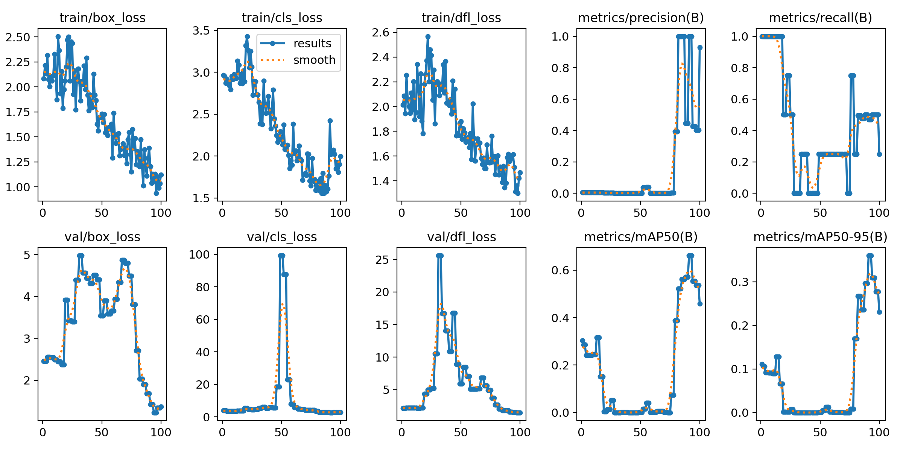
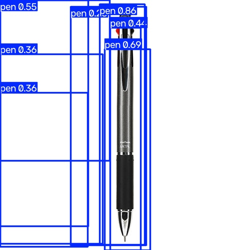
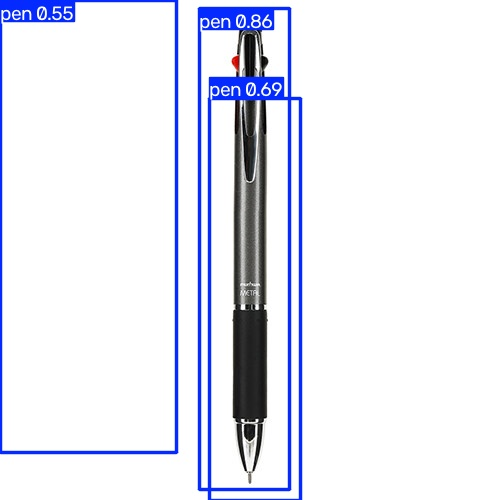
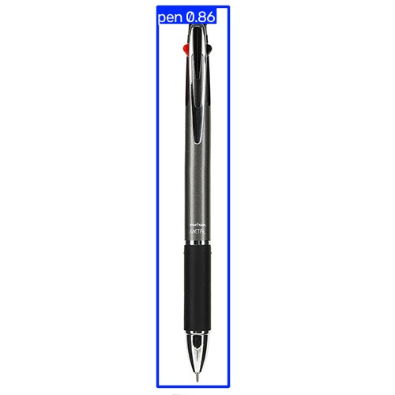

# YOLOv8 Custom Object Detection - Ballpoint Pen (볼펜 탐지)

YOLOv8을 이용해 볼펜(pen) 객체를 인식하는 커스텀 모델을 학습한 프로젝트입니다.

## 1. 프로젝트 개요

- **목표**: 볼펜 이미지를 직접 라벨링하고, YOLOv8 모델을 커스텀 학습시켜 볼펜을 인식하는 모델 만들기
- **클래스**: `pen` (1종 단일 클래스)
- **환경**: Anaconda 가상환경 `vision_ai2`, Python

## 2. 데이터셋

- 인터넷에서 수집한 볼펜 이미지 **총 17장**
- 다양한 각도, 배경(책상 위, 손에 쥔 모습, 흰 배경 등)으로 구성
- `labelme`로 직접 바운딩 박스 라벨링 진행 (라벨명: `pen`)
- `labelme2yolo`를 이용해 YOLO 형식으로 변환 (train/val/test = 0.7 / 0.15 / 0.15)

## 3. 학습 과정

| 단계 | 내용 |
|---|---|
| 1 | Anaconda 가상환경(`vision_ai2`) 생성 |
| 2 | `labelme` 설치 및 이미지 라벨링 |
| 3 | `labelme2yolo`로 YOLO 데이터셋 변환 |
| 4 | `ultralytics`(YOLOv8) 설치 및 학습 |
| 5 | 학습된 모델(`best.pt`)로 새 이미지 예측(predict) 테스트 |

### 학습 명령어
```bash
yolo detect train data=dataset.yaml model=yolov8n.pt epochs=100 imgsz=640
```

### 학습 조건
- Base model: `yolov8n.pt`
- Epochs: 100
- Image size: 640

## 4. 학습 결과 (`results/`)

- `results.png`: train/val loss, precision, recall, mAP 그래프
- `confusion_matrix.png`: 혼동 행렬
- `results.csv`: epoch별 수치 데이터



데이터가 8장일 때보다 **17장으로 보강한 뒤 mAP50 최고 약 0.6대**까지 개선을 확인했습니다. 다만 학습 데이터가 여전히 적어 val/mAP 그래프가 다소 불안정하게 나타나는 한계가 있었습니다.

## 5. 예측(Predict) 결과 (`predicts/`)

새로운 볼펜 이미지로 학습된 모델을 테스트한 결과이며, confidence threshold(`conf`) 값에 따른 변화를 비교하기 위해 3장을 순서대로 저장했습니다.

| 초기 예측 (기본 conf) | conf=0.5 | conf=0.7 (최종) |
|---|---|---|
|  |  |  |

1. **초기 예측 결과** (기본 conf) - 볼펜의 여러 부위에 박스가 중복으로 겹쳐 나타남
2. **conf=0.5 적용 결과** - 중복 박스가 일부 정리됨 (pen 0.55 / 0.86 / 0.69)
3. **conf=0.7 적용 결과 (최종)** - `pen 0.86` 단일 박스로 볼펜 전체를 정확히 인식

```bash
yolo detect predict model=weights/best.pt source="테스트이미지.jpg" conf=0.7
```

## 6. 폴더 구조

```
yolo-pen-detection/
├── images/          # 원본 볼펜 이미지 (17장)
├── labels/           # labelme로 생성한 json 라벨 파일
├── dataset.yaml       # YOLO 데이터셋 설정 파일
├── results/           # 학습 결과 그래프 및 지표
├── weights/
│   └── best.pt        # 학습된 최종 모델
├── predicts/          # conf 값별 예측 결과 이미지 3장
└── README.md
```

## 7. 느낀 점 / 한계

- 데이터 개수가 적을수록(8장) 학습이 불안정하고, 개수를 늘릴수록(17장) mAP와 예측 confidence가 눈에 띄게 개선되는 것을 확인함
- 같은 모델이라도 predict 시 `conf` 값 조정에 따라 중복 박스 문제를 완화할 수 있음
- 더 안정적인 모델을 위해서는 30장 이상, 가능하면 100장 이상의 데이터가 필요할 것으로 보임
