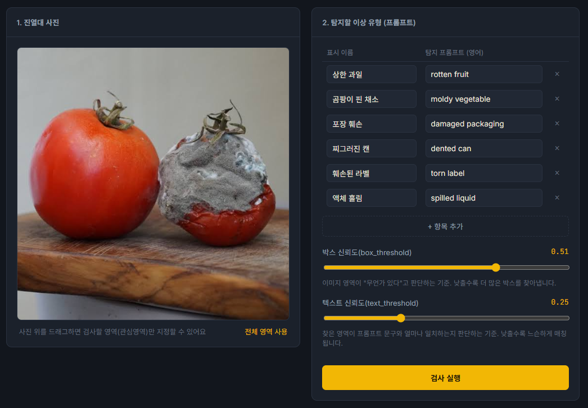
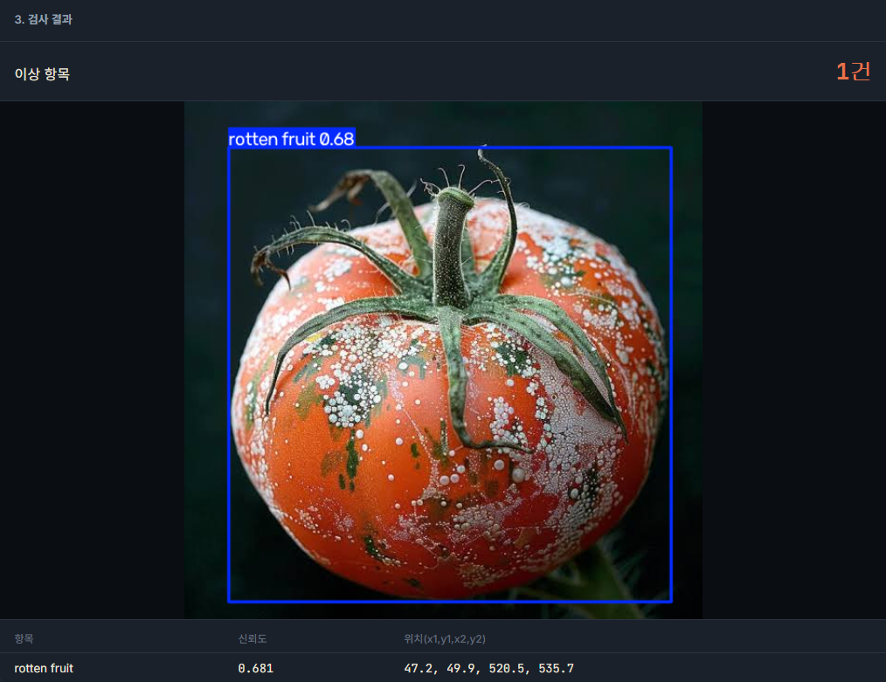

# 상한 걸 놓치지 않았나요? — 냉장 진열대 품질 체크 (Grounding DINO)

> 다른 구현체와의 비교는 [비교 문서](../docs/comparison.md)를 참고하세요.

냉장 진열대 사진을 올리면, 원하는 이상 유형(상한 과일, 곰팡이 핀 채소, 포장 훼손, 찌그러진 캔, 훼손된 라벨, 액체 흘림 등)을 문장으로 지정해 즉석에서 찾아냅니다. Grounding DINO(zero-shot phrase grounding)를 사용해서, 새로운 이상 유형이 생겨도 재학습 없이 프롬프트 문장만 추가하면 바로 탐지할 수 있습니다.

## 실행 방법

```bash
pip install -r requirements.txt
python app.py
```

실행하면 `http://localhost:5000`이 자동으로 열립니다. 처음 실행 시 모델 가중치(수백MB~1GB대)를 다운로드하므로 시간이 걸릴 수 있습니다.

## 사용 예시

정상 토마토와 곰팡이 핀 토마토를 나란히 올리고, 프롬프트 `moldy vegetable` / `rotten fruit`로 검사한 결과입니다.

**1. 사진 업로드 + 프롬프트 설정**



**2. 검사 결과** — 정상 토마토는 걸러지고, 곰팡이 핀 토마토만 정확히 탐지됨


누가 봐도 확실하게 곰팡이가 심하게 핀 토마토 한 장만 단독으로 검사하면, 신뢰도가 더 높게(0.681) 나옵니다 — 이상 정도가 뚜렷할수록 신뢰도도 그만큼 뚜렷하게 올라가는 걸 보여줍니다.



## 주요 파라미터

- `box_threshold`: 이미지 영역이 "무언가 있다"고 판단하는 기준. 낮출수록 더 많은 박스를 찾아내지만, 오탐도 늘어남 (권장: 0.4~0.55)
- `text_threshold`: 찾은 영역이 프롬프트 문구와 얼마나 일치하는지 판단하는 기준

## 참고

- 프롬프트는 영어 문장으로 입력해야 합니다 (탐지 모델이 영어 텍스트 인코더 사용).
- 여러 프롬프트를 각각 독립적으로 모델에 넣어 탐지하므로, 프롬프트 개수만큼 처리 시간이 늘어납니다.
- CPU 환경에서는 이미지 1장 분석에 수 초~수십 초가 걸릴 수 있습니다.
