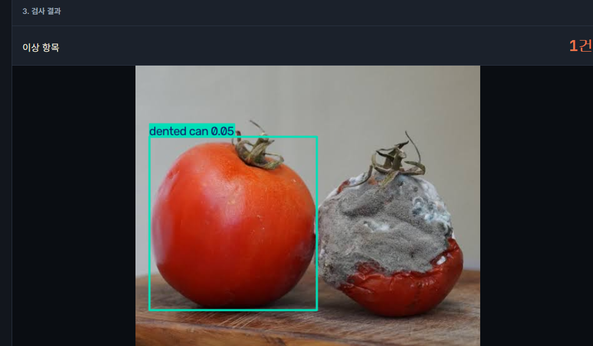

# 상한 걸 놓치지 않았나요? — 냉장 진열대 품질 체크 (YOLO-World)

> 다른 구현체와의 비교는 [상위 README](../README.md)를 참고하세요.

냉장 진열대 사진을 올리면, 원하는 이상 유형(상한 과일, 곰팡이 핀 채소, 포장 훼손, 찌그러진 캔, 훼손된 라벨, 액체 흘림 등)을 문장으로 지정해 즉석에서 찾아냅니다. YOLO-World(open-vocabulary object detection)를 사용해서, 새로운 이상 유형이 생겨도 재학습 없이 프롬프트만 추가하면 바로 탐지할 수 있습니다.

## 실행 방법

```bash
pip install -r requirements.txt
python app.py
```

실행하면 `http://localhost:5000`이 자동으로 열립니다. 처음 실행 시 `yolov8x-worldv2.pt` 가중치를 자동으로 다운로드합니다 (수백MB대). 원래는 훨씬 가벼운 `yolov8s-worldv2`(수십MB)로 시작했지만, 정상/이상 물체를 구분하는 정확도가 너무 낮아서 x 버전으로 올렸습니다 — 자세한 수치는 [상위 README](../README.md)를 참고하세요.

## 주요 파라미터

- `threshold` (confidence): 탐지 결과를 얼마나 확신할 때 표시할지 결정하는 기준값. 낮출수록 더 많은 박스를 찾아내지만 오탐도 늘어남 (기본값 0.3)

## 한계: 정상 물체를 오탐하는 문제

정상 토마토와 곰팡이 핀 토마토를 나란히 놓고 테스트했을 때, 임계값을 아무리 조절해도 **정상 토마토 쪽을 계속 결함으로 오탐**했습니다.

| 임계값 0.5 (`yolov8s-worldv2`, 개선 전) | 임계값 0.33 (`yolov8x-worldv2`, 모델 교체 후) |
|---|---|
|  |  |
| 정상 토마토가 `dented can 0.05`로 잘못 표시됨 — 신뢰도 0.05는 임계값 0.5보다 훨씬 낮은데도 나타나, 처음엔 UI가 재검사 없이 이전 결과를 보여주는 것으로 의심했음 | 모델을 `yolov8x-worldv2`로 올린 뒤에도 정상 토마토가 `rotten fruit 0.40`으로 잡히고, 정작 진짜 곰팡이 핀 토마토는 상위 결과에 나오지 않음 |

두 결과 모두 원인은 같습니다. **YOLO-World는 이 두 토마토 중 어느 쪽이 더 "상했는지"를 애초에 제대로 구분하지 못합니다.** 정상 쪽 신뢰도가 곰팡이 쪽보다 높게 나오는 경우까지 있어서, 임계값을 어디에 두든 정답만 골라내는 지점이 없습니다. `yolov8s`→`yolov8x`로 모델을 키워도 이 순위 역전 문제 자체는 완전히 해결되지 않았습니다. 자세한 수치 비교는 [상위 README의 "모델별 정확도 비교"](../README.md#모델별-정확도-비교-같은-사진-같은-프롬프트로-실측) 참고.

## 참고

- 프롬프트는 영어 문장으로 입력해야 합니다.
- 각 프롬프트가 독립된 클래스로 등록되고(`model.set_classes`), ultralytics가 내부적으로 NMS를 처리합니다.
- GPU 환경에서는 모델 로드 직후 반드시 `model.to(device)`를 명시적으로 호출해야 합니다. 안 하면 `set_classes()`의 CLIP 텍스트 인코더가 다른 디바이스에 놓여서 두 번째 검사부터 크래시가 납니다 (이미 `app.py`에 반영되어 있습니다).
