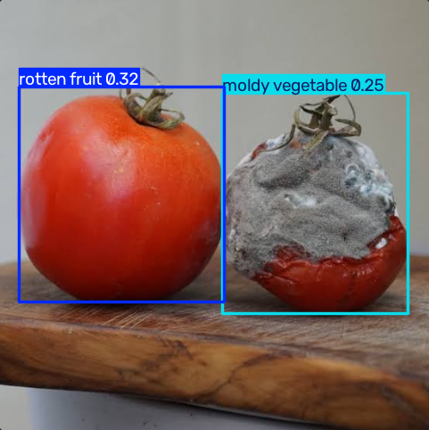

# 상한 걸 놓치지 않았나요? — 냉장 진열대 품질 체크 (YOLOE)

> 다른 구현체와의 비교는 [비교 문서](../docs/comparison.md)를 참고하세요.

냉장 진열대 사진을 올리면, 원하는 이상 유형(상한 과일, 곰팡이 핀 채소, 포장 훼손, 찌그러진 캔, 훼손된 라벨, 액체 흘림 등)을 문장으로 지정해 즉석에서 찾아냅니다. YOLOE(prompt-free/open-vocabulary 겸용 탐지기)를 사용해서, 새로운 이상 유형이 생겨도 재학습 없이 프롬프트만 추가하면 바로 탐지할 수 있습니다.

## 실행 방법

```bash
pip install -r requirements.txt
python app.py
```

실행하면 `http://localhost:5000`이 자동으로 열립니다. 처음 실행 시 `yoloe-11l-seg.pt` 가중치(70MB대)와, 텍스트 프롬프트를 임베딩으로 바꾸는 데 쓰이는 CLIP 텍스트 인코더(mobileclip, 600MB대)를 자동으로 다운로드합니다 — 두 번째 다운로드가 꽤 커서 첫 실행은 시간이 걸립니다.

## 사용 예시

정상 토마토와 곰팡이 핀 토마토를 나란히 올리고, 프롬프트 6개 전부, 민감도 0.2로 검사한 결과입니다.



곰팡이 핀 토마토(`moldy vegetable 0.25`)보다 정상 토마토(`rotten fruit 0.32`) 쪽 신뢰도가 더 높게 나옵니다 — 즉 임계값을 어디에 두든 정답만 골라낼 수 없는 상황입니다. 왜 이런 결과가 나오는지는 [비교 문서](../docs/comparison.md#모델별-정확도-비교-같은-사진-같은-프롬프트로-실측)에 다른 모델들과 함께 정리해뒀습니다.

## 주요 파라미터

- `threshold` (confidence): 탐지 결과를 얼마나 확신할 때 표시할지 결정하는 기준값. 낮출수록 더 많은 박스를 찾아내지만 오탐도 늘어남 (기본값 0.2)

## 참고

- 프롬프트는 영어 문장으로 입력해야 합니다.
- `yoloe-11l-seg` 는 세그멘테이션 모델이라 `r.plot()`을 그대로 쓰면 감지 영역 전체를 반투명 색으로 덮어 그립니다. 다른 두 구현과 화면을 통일하기 위해 `r.plot(masks=False)`로 바운딩 박스만 그리도록 했습니다.
- 프롬프트를 텍스트 임베딩으로 바꾸는 `get_text_pe()` + `set_classes()` 방식은 YOLO-World의 `set_classes(prompts)`와 비슷하지만 별도 단계로 나뉘어 있습니다.
- GPU 환경에서는 모델 로드 직후 `model.to(device)`를 명시적으로 호출해야 합니다 (YOLO-World와 동일한 이유).
