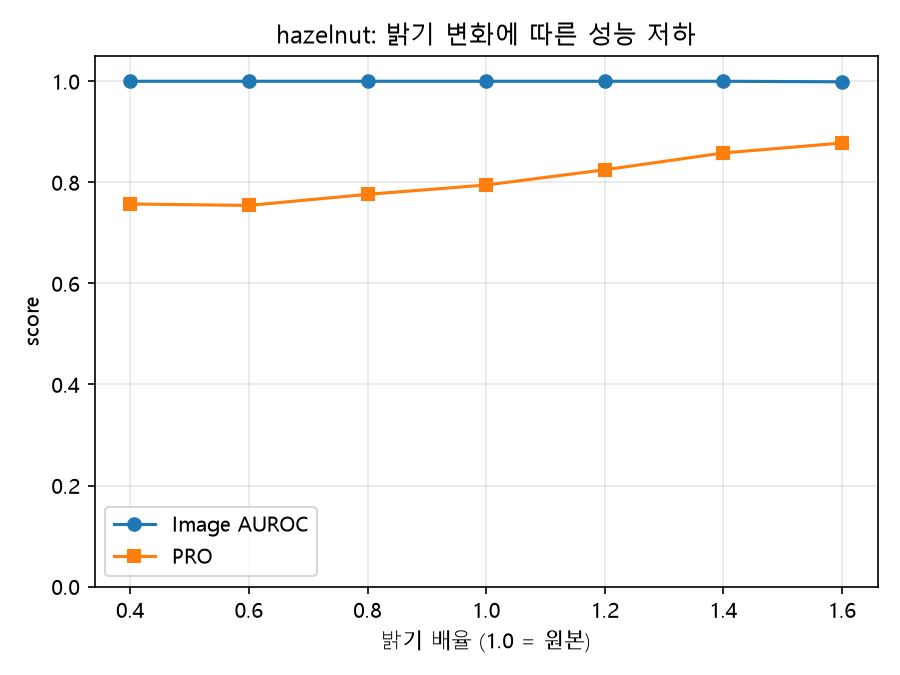
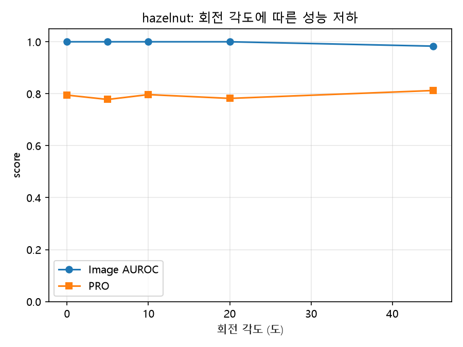
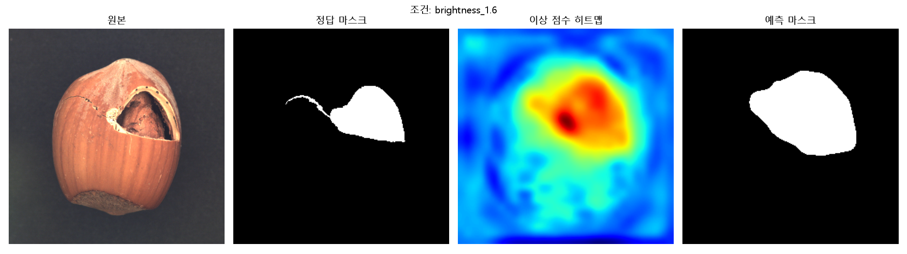
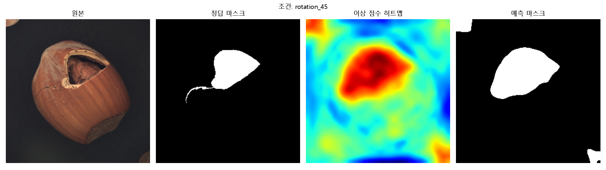
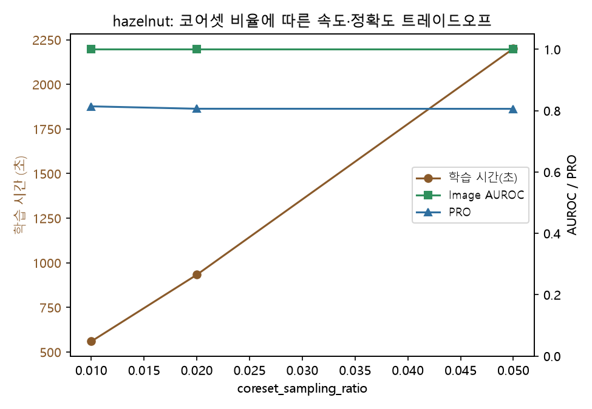

# 조명·각도 강건성 실험 — PatchCore / hazelnut

`17_Anomoly_Detection/patchcore_anomaly_detection.py`(실습 8 기본 코드)를 그대로 재사용해, bottle이 아닌 **hazelnut** 카테고리로 PatchCore 이상 탐지 memory bank를 한 번만 만들고, 테스트 이미지에 **밝기 7단계 · 회전 5단계** 변형을 가해 같은 memory bank로 재채점하는 실험입니다. 학습은 고정한 채 테스트 조건만 바꿔서, 어느 지점부터 성능이 무너지는지를 봅니다.

**왜 필요한가**: 실제 생산 현장에서는 조명과 카메라 각도가 완벽히 통제되지 않기 때문에, 이런 변동에도 이상 탐지 성능이 유지되는지 사전에 검증해야 하기 때문입니다.

**결과 리포트**: [Hazelnut Robustness Report](https://claude.ai/artifact/FFpjcT38ispkB6P5hsHHK6) (모든 수치·그래프·시각화 정리)

## 카테고리 선택 이유

carpet·leather·wood 같은 텍스처 카테고리는 회전시켜도 패턴이 거의 동일해 강건성 실험의 효과가 잘 드러나지 않습니다. hazelnut은 객체 카테고리라 각도·조명에 따라 외형이 실제로 달라지고, 원본 데이터셋 자체가 "놓인 방향이 제각각"이라 회전 변형 실험과 성격이 잘 맞습니다.

## 필수 요건 체크리스트

| # | 요건 | 구현 위치 |
|---|---|---|
| 1 | bottle을 제외한 카테고리 1개 이상 사용 | hazelnut 사용 (`run_baseline.py`, `run_experiment.py`) |
| 2 | Image AUROC와 PRO를 함께 제시 | `anomalib.metrics.AUROC` + `PRO` 둘 다 계산 (기본 코드엔 PRO가 없어서 직접 추가) |
| 3 | 파라미터/모델을 바꿔 2회 이상 비교, 표로 정리 | 밝기 7단계 + 회전 5단계 = 2개 축, `results/metrics.csv`로 정리 |
| 4 | 정상 이미지 결과로 과검출 확인 | 정상 이미지 40장만 따로 걸러 조건별 오탐율(`normal_FPR`) 집계 |

## 핵심 발견

**회전 45°에서 image AUROC는 0.983으로 여전히 높은데, 정상 이미지 오탐율만 87.5%로 폭발합니다.** "이상/정상을 구분하는 능력"은 유지되지만, 학습 때 정해둔 임계값이 45° 회전에서는 더 이상 맞지 않는다는 뜻입니다. AUROC 하나만 보면 "거의 멀쩡하다"고 오판하기 쉬운 지점이라, PRO·오탐율을 같이 봐야 하는 이유를 그대로 보여줍니다.

결함 유형별로 쪼개보면 더 뚜렷합니다 — crack·cut·hole·print 결함은 회전 45°에서도 거의 100% 그대로 잡히는데, **정상(good) 이미지만 정확도가 100%→10%로 무너집니다.** 45° 회전이 망가뜨리는 건 "진짜 결함을 찾는 능력"이 아니라 "정상을 정상으로 보는 능력"이라는 뜻입니다.

**코어셋 비율은 0.01만으로 이미 충분했습니다.** memory bank에 남기는 패치 비율을 0.01→0.02→0.05로 5배 키워봤는데, image AUROC(1.0000 고정)도 PRO(0.814→0.806→0.806)도 사실상 그대로였고, 달라진 건 학습 시간뿐이었습니다(9분→16분→37분). 즉 메모리 뱅크를 더 촘촘하게 만든다고 정확도가 좋아지는 게 아니라, 어느 지점을 넘으면 "대표성 있는 정상 패치 몇 개"만으로 이미 충분하다는 뜻입니다 — PatchCore의 coreset 선택 아이디어(서로 멀리 떨어진 패치를 우선 고르는 방식)가 실제로 효율적으로 작동하고 있다는 간접 증거이기도 합니다.

## 실행 결과

11개 조건 전체 수치입니다 (`results/metrics.csv`). 정상 오탐율 = 결함이 없는 정상 이미지 40장 중 모델이 "이상"으로 잘못 판정한 비율이고, memory bank는 모든 행에서 동일(baseline 1회 학습)합니다.

| 조건 | Image AUROC | PRO | 정상 오탐율 |
|---|---|---|---|
| baseline (원본) | 1.0000 | 0.7947 | 0 / 40 |
| 밝기 × 0.4 | 1.0000 | 0.7571 | 0 / 40 |
| 밝기 × 0.6 | 1.0000 | 0.7543 | 0 / 40 |
| 밝기 × 0.8 | 1.0000 | 0.7762 | 0 / 40 |
| 밝기 × 1.2 | 1.0000 | 0.8248 | 0 / 40 |
| 밝기 × 1.4 | 1.0000 | 0.8581 | 0 / 40 |
| 밝기 × 1.6 | 0.9989 | 0.8778 | 1 / 40 |
| 회전 5° | 1.0000 | 0.7779 | 0 / 40 |
| 회전 10° | 1.0000 | 0.7966 | 0 / 40 |
| 회전 20° | 1.0000 | 0.7821 | 0 / 40 |
| **회전 45°** | **0.9832** | 0.8124 | **35 / 40** |

밝기 7단계(0.4–1.6배)와 회전 5단계(0–45°) 각각에서 image AUROC·PRO가 어떻게 변하는지 보여주는 저하 곡선입니다:

| 밝기 변화 | 회전 변화 |
|---|---|
|  |  |

가장 저하가 컸던 두 조건(밝기 1.6배, 회전 45°)에서 결함 이미지 한 장을 원본·정답 마스크·이상 점수 히트맵·예측 마스크 4분할로 띄운 화면입니다:

| 밝기 1.6배 | 회전 45° |
|---|---|
|  |  |

코어셋 비율(0.01/0.02/0.05)을 바꿔가며 학습 시간과 정확도를 비교한 그래프입니다 — 비율을 키워도 AUROC·PRO는 거의 그대로인데 학습 시간만 늘어나서, 0.01이 이미 충분하다는 걸 확인했습니다:



## 환경

이 프로젝트는 **`anomaly_env`라는 별도 conda 환경**을 씁니다. 기존에 다른 프로젝트들에 쓰던 `vision_ai2`는 torch 2.12.0+cu130이 이미 깔려있었는데, `anomalib`을 거기 바로 설치하면 의존성 충돌로 torch 버전이 바뀌면서 기존 프로젝트들이 깨질 위험이 있었습니다.

```bash
conda create -n anomaly_env python=3.11
conda activate anomaly_env
pip install "anomalib[cpu]" matplotlib
# GPU(CUDA) 쓰려면 아래로 torch를 교체 (자세한 이유는 "겪었던 문제" 참고)
pip install torch==2.12.0 torchvision==0.27.0 --index-url https://download.pytorch.org/whl/cu130 --force-reinstall --no-cache-dir
```

## 실행 순서

```bash
# 데이터: 00_Dataset/hazelnut/ 에 MVTec AD 구조로 준비 (train/good, test/<결함종류>, ground_truth)
# ⚠ 주의: 카테고리 폴더만 받을 것 — 상위(MVTec AD 전체)를 그대로 두면 4.9GB 전체 다운로드가 시작됨

# 1단계: 기본 코드 그대로 실행 (hazelnut baseline 확인)
python run_baseline.py

# 2단계: 밝기 7단계 + 회전 5단계 강건성 실험
python run_experiment.py

# 확장: 코어셋 비율 스윕 + 오탐 사례 분석 + 결함 유형별 검출률
python run_extensions.py
```

## 겪었던 문제

### CPU에서 coreset 선택이 비현실적으로 느림 (수정함)

기본값 `coreset_sampling_ratio=0.1`로 돌렸더니, memory bank를 만드는 coreset 그리디 선택(최근접 거리 갱신을 수만 번 반복) 하나에만 1시간 넘게 걸렸습니다. 이 실험은 memory bank를 고정하고 조건을 10개 넘게 바꿔가며 평가해야 해서, 학습 한 번이 느리면 전체가 비현실적으로 길어집니다.

**수정**: `coreset_sampling_ratio=0.01`로 낮췄습니다. 나중에 확장 실험(코어셋 비율 스윕)으로 직접 검증해보니, 0.01/0.02/0.05 전부 AUROC가 똑같이 1.0으로 나와서 — 애초에 0.01이면 충분했다는 게 확인됐습니다.

### Windows에서 DataLoader 워커가 오히려 느림 (수정함)

`num_workers=4`로 뒀더니 로그에 같은 import 경고가 워커 수만큼 중복 출력되는 게 보였습니다. Windows는 워커 프로세스를 띄울 때마다 전체 모듈을 재import해서, 이번처럼 이미지 수가 적은 데이터셋(수백 장)에서는 워커 생성 오버헤드가 오히려 더 큽니다. `num_workers=0`으로 바꾸니 체감상 훨씬 빨라졌습니다.

### 원본 스크립트의 `os.chdir`이 우리 결과물까지 끌고감 (수정함)

`patchcore_anomaly_detection.py`는 import되는 순간 자기 자신의 위치(`17_Anomoly_Detection/`)로 `os.chdir` 해버립니다. 그대로 두면 우리가 만든 체크포인트·결과 파일이 원본 폴더 밑에 생겨서 뒤섞입니다. `run_baseline.py`/`run_experiment.py`에서 import 직후 다시 `anomaly_robustness/`로 chdir을 되돌려서, 결과물이 전부 이 폴더 안에만 생기게 했습니다.

### anomalib이 변형 함수를 (이미지, 마스크) 쌍으로 호출함 (수정함)

밝기·회전 변형 함수를 처음엔 PIL 이미지 하나만 받아서 처리하도록 짰더니 `TypeError`가 났습니다. 확인해보니 anomalib은 세그멘테이션 태스크에서 `augmentations(image, mask)`로 이미지와 결함 마스크를 같이 넘겨서 같이 변형하라고 요구합니다 (회전처럼 기하학적 변형일 때 이미지와 마스크 위치가 어긋나면 안 되기 때문). 게다가 이미지는 PIL이 아니라 torch 텐서(C,H,W, uint8)로 들어옵니다. `perturbations.py`를 텐서 기준으로 (image, mask) 쌍을 받고 돌려주도록 다시 짰습니다.

### 회전 시 검은 모서리가 가짜 결함으로 오탐될 뻔함 (사전에 방지함)

스펙에서 미리 경고했던 지점입니다 — 회전하면 이미지 모서리에 빈 공간이 생기는데, 검은색(constant)으로 채우면 그 자체가 "배경과 다른 영역"이라 오탐될 수 있습니다. 이미지는 `cv2.warpAffine`의 `BORDER_REFLECT_101`로 가장자리를 거울처럼 비춰 채웠고, 결함 마스크는 반사시키면 없던 결함이 복제돼 보일 수 있어서 빈 공간을 0(정상)으로 채웠습니다.

### matplotlib 그래프의 한글이 깨짐 (수정함)

처음 그래프를 만들었을 때 한글 라벨이 전부 네모(□)로 깨져서 나왔습니다. matplotlib에 한글 폰트를 지정 안 해줘서였습니다. `plt.rcParams["font.family"] = "Malgun Gothic"`을 추가해서 고쳤습니다.

### 백그라운드 프로세스가 도구의 30분 제한에 걸림 (해결함)

실험 하나가 CPU에서 30분 넘게 걸리는데, 터미널 도구의 백그라운드 실행 시간 제한(약 30분)에 걸려 몇 번 중간에 끊겼습니다. `python ... &`로 완전히 분리(detach)된 프로세스로 띄우니 도구 제한과 무관하게 끝까지 돌릴 수 있었습니다.

### torch가 CPU 전용으로 깔림, GPU 환경 불일치 (수정함)

`anomaly_env`를 새로 만들고 `pip install anomalib[cu126]`로 설치했는데, 정작 torch는 CPU 전용 빌드가 깔렸습니다. 기본 PyPI의 torch 휠은 Python 버전과 무관하게 전부 CPU 전용이고, 다른 프로젝트에 쓰던 `vision_ai2`의 torch(2.12.0+cu130)는 PyTorch 공식 CUDA 인덱스(`https://download.pytorch.org/whl/cu130`)에서 받은 거였습니다. 같은 인덱스를 명시해서 재설치하니 GPU(RTX 3080)가 잡혔습니다 — 두 환경의 torch 빌드가 같아져서 일관성도 맞췄습니다.

## 파일 구성

```
anomaly_robustness/
├── run_baseline.py       # 1단계: 기본 코드 그대로 hazelnut baseline 확인
├── perturbations.py      # 밝기·회전 변형 함수 (anomalib의 (image, mask) 호출 규약에 맞춤)
├── run_experiment.py     # 2단계: 밝기 7단계 + 회전 5단계 강건성 실험
├── run_extensions.py     # 확장: 코어셋 비율 스윕 + 오탐 사례 + 결함 유형별 검출률
├── report.html           # 결과 리포트 페이지 (Artifact로 발행한 것과 동일한 소스)
├── requirements.txt
├── results/              # metrics.csv, 저하 곡선, 시각화 그리드, 확장 실험 결과
├── checkpoints_merged/    # 학습된 PatchCore 체크포인트 (용량 문제로 git에는 제외)
└── logs/                  # 실행 로그
```

## 다음 단계 (포트폴리오 확장 포인트)

- 다른 카테고리(carpet 등)를 받아서 "텍스처 vs 객체" 카테고리별 강건성 비교
- OpenVINO로 내보내 CPU 추론 속도 측정 (기본 코드에 `export` 모드가 이미 있음)
- Gradio 이미지 업로드형 검사 데모 제작
- 랜덤 시드 고정으로 coreset 선택의 run-to-run 변동 제거 (지금은 재실행마다 오탐율이 조금씩 다르게 나옴)
