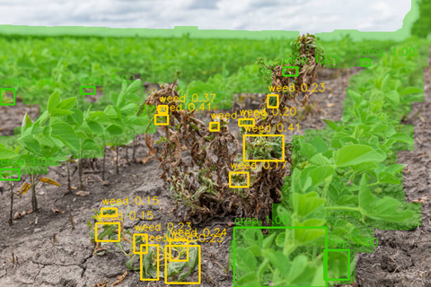
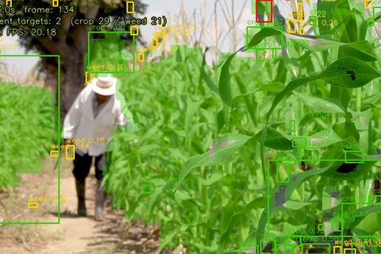
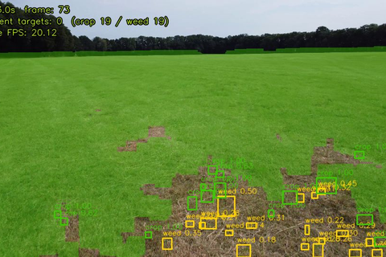
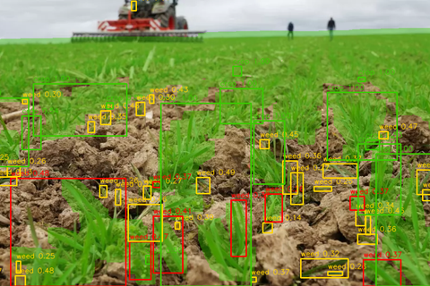
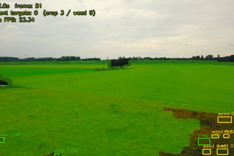
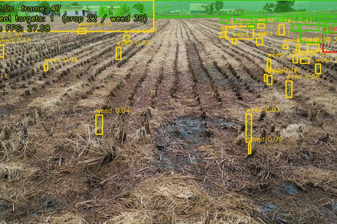
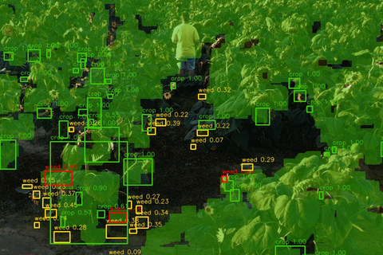
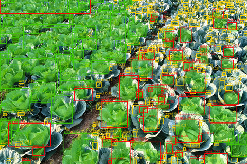
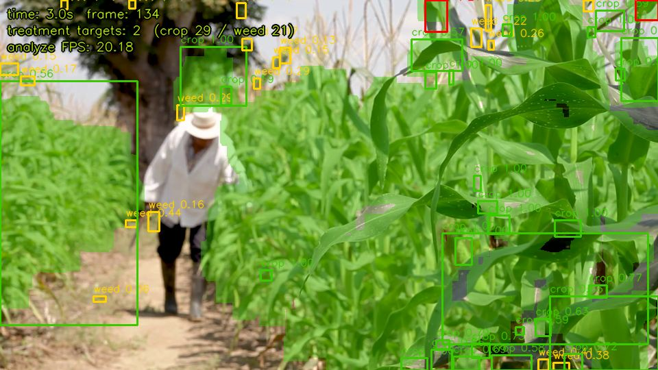

# 농경지 작물·잡초 구분 및 방제 판단 시스템

`08_RoadSegmentation`류(세그멘테이션 + 객체 탐지 결과를 합쳐 상황을 판단하는 골격)를 농경지에 적용한 프로젝트입니다. 밭 영상에서 작물이 심어진 **고랑(재배 영역)을 분할**하고, 그 위의 **개별 식물체를 탐지**해 "고랑 안인데 잡초로 판정된 개체"만 방제 대상으로 표시합니다.

**왜 필요한가**: 잡초를 자동으로 구분하면 밭 전체가 아니라 필요한 지점에만 제초제를 뿌릴 수 있어, 비용과 환경 부담을 크게 줄일 수 있기 때문입니다.

## 필수 요건 체크리스트

| # | 요건 | 구현 위치 |
|---|---|---|
| 1 | 세그멘테이션 + 객체 탐지 결과를 함께 사용 | `pipeline/segmentation.py`(고랑 분할) + `pipeline/detection.py`(식물체 탐지·분류) |
| 2 | 두 결과를 겹쳐 상황 판단 로직 | `pipeline/decision.py` — 고랑 마스크 ∩ weed 박스 → 방제 대상 |
| 3 | FP32/FP16/INT8 중 2개 이상 FPS·자원 사용률 비교 (같은 영상) | `pipeline/benchmark.py` |
| 4 | 판단 결과가 화면에 표시되는 데모 (실시간 + FPS) | `app.py` + `templates/index.html` — 이미지 업로드 분석 + `sample_data/`의 영상을 프레임별로 분석해 실시간 스트리밍(고랑 오버레이 + 박스 + 방제 대상 수 + FPS를 화면에 직접 표시) |

## 파이프라인 구조

```
[입력 이미지]
      │
      ▼
[1단계] 고랑(작물 재배 영역) 분할 — ExG(Excess Green Index) 규칙 기반, 학습 불필요
      ▼
[2단계] 개별 식물체 탐지 + crop/weed 분류
      │   - models/yolov8_crop_weed.pt 가 있으면 YOLOv8 사용
      │   - 없으면 "주변 식생 밀도" 기반 규칙으로 자동 대체 (MVP 기본값)
      ▼
[3단계] 판단 로직 — 고랑 마스크 ∩ weed 박스 → 방제 대상
      ▼
[결과] 방제 대상 개수 + 시각화 + FPS
```

## 실행 결과

실제 밭 사진(대두 이랑)으로 테스트한 화면입니다. 초록 박스=작물, 노랑 박스=고랑 밖 잡초(무시), 빨강 박스=방제 대상(고랑 안 잡초):


## 다양한 사진·영상으로 테스트한 결과 (성공/실패 모음)

이 파이프라인이 **어떤 조건에서 잘 되고 어떤 조건에서 안 되는지**를 명확히 보여주기 위해, 성격이 다른 사진·영상 8개를 모아 전부 돌려봤습니다. 결과를 정리하면 이렇습니다.

| # | 소재 | 판정 | 이유 |
|---|---|---|---|
| 1 | 대두밭 사진 (사람 눈높이, 줄 뚜렷) | ✅ 성공 | 고랑·개별 포기가 뚜렷하고 밀도 차이도 확실함 |
| 2 | 옥수수밭 영상 (농부가 고랑 사이를 걸음) | ✅ 성공 | 위 조건과 동일 + 영상에서도 안정적으로 재현됨 |
| 3 | 잔디밭 영상 | ❌ 실패 | 밭이 아니라 화면 전체가 균일한 잔디라 구분 대상 자체가 없음 |
| 4 | 지면 눈높이 사진 (아주 낮은 각도) | ❌ 실패 | 고랑 구조가 안 보이고 원근 때문에 판정이 사실상 무작위 |
| 5 | 고고도 드론 곡물밭 영상 | ❌ 실패 | 너무 높아서 화면 전체가 "하나의 큰 초록 덩어리"로만 보임 |
| 6 | 추수 끝난 벼 그루터기밭 영상 | ❌ 실패 | 초록 식생이 거의 없어서(다 갈색) ExG가 찾을 게 없음 |
| 7 | 시든 해바라기밭 영상 (캐노피 높이 촬영) | ❌ 실패 | 위에서 보는 게 아니라 캐노피 옆면을 봐서 고랑이 안 보임 |
| 8 | 촘촘한 양배추밭 사진 | ❌ 실패 (새로운 유형) | 잎맥·잎 색 굴곡이 심해서 한 포기가 여러 조각으로 과다 분할됨 |

**성공 사례 2개** (클릭하면 원본 크기로 볼 수 있습니다):

| 대두밭 사진 | 옥수수밭 영상 |
|---|---|
| [](docs/images/result1.png) | [](docs/images/video_demo.png) |

**실패 사례 6개** (위쪽 텍스트가 영상 실시간 데모의 오버레이 정보입니다. 클릭하면 원본 크기로 볼 수 있습니다):

| 잔디밭 (밭 아님) | 지면 눈높이 (각도 낮음) | 고고도 드론 (너무 높음) |
|---|---|---|
| [](docs/images/gallery_grass.png) | [](docs/images/gallery_ground.png) | [](docs/images/gallery_highalt.png) |

| 추수 후 (식생 없음) | 시든 해바라기 (캐노피 높이) | 양배추 (과다 분할) |
|---|---|---|
| [](docs/images/gallery_stubble.png) | [](docs/images/gallery_sunflower.png) | [](docs/images/gallery_cabbage.png) |

**정리하면**, 이 규칙 기반 파이프라인이 잘 동작하려면 세 조건이 동시에 맞아야 합니다:
1. **살아있는 초록 식생**이어야 함 (마르거나 추수된 상태는 안 됨)
2. **위에서 내려다보는 각도**여야 함 (눈높이·캐노피 옆면은 안 됨, 너무 높아도 안 됨)
3. **개별 포기가 시각적으로 구분**돼야 함 (너무 빽빽하게 뭉치거나 잎맥이 너무 도드라지면 과다 분할됨)

실제 농업 현장에서도 카메라 각도·고도·작물 생육 단계에 따라 비전 시스템의 정확도가 크게 달라진다는 걸 직접 확인한 셈이라, 포트폴리오 관점에서는 오히려 이 실패 사례들이 "규칙 기반 방식의 한계를 정확히 이해하고 있다"는 근거가 될 수 있다고 생각합니다.

## 겪었던 문제: 방제 대상이 계속 0으로 나옴 (버그, 수정함)

실제 사진으로 처음 테스트했을 때, 잡초가 12개나 검출됐는데도 **"방제 필요"가 항상 0**으로 나오는 문제가 있었습니다. 원인은 두 가지였습니다.

1. **고랑 마스크가 듬성듬성 끊겨 있었음**: 합성 테스트 이미지와 달리 실제 밭 사진은 포기 사이사이 흙이 드러나 있어서, ExG 기반 식생 마스크가 "구멍이 숭숭 뚫린" 형태가 됐습니다. 이 상태에서 "박스 면적의 50% 이상이 고랑에 걸쳐야 고랑 안"이라는 기준을 쓰니, 박스가 명백히 고랑 한가운데 있어도 절반 기준을 못 채우는 경우가 많았습니다.
   **수정**: `segmentation.py`에서 큰 식생 덩어리를 고른 뒤 팽창(dilate, 25×25 커널)을 추가해 포기 사이 간격을 메워 하나의 이어진 재배 영역으로 만들었습니다. 판정 기준도 `decision.py`에서 "박스 중심점이 고랑 마스크 안에 있는가"로 바꿔서, 마스크에 남은 작은 구멍에 덜 민감하도록 했습니다.
2. **로컬 테스트 중 서버 프로세스가 완전히 안 죽고 여러 개 떠 있었음**: 코드를 고치고 서버를 재시작했다고 생각했는데, 실제로는 이전 프로세스가 포트를 계속 점유하고 있어서 수정 전 코드로 계속 응답하고 있었습니다. `netstat -ano`로 포트 점유 프로세스를 확인해서 전부 종료한 뒤에야 수정 사항이 반영된 걸 확인할 수 있었습니다.

수정 후 같은 사진으로 다시 돌리니 방제 대상이 정상적으로 잡혔습니다.

## 겪었던 문제: 화면 절반을 덮는 거대한 박스가 "잡초 1개"로 잡힘 (버그, 수정함)

위 수정 이후 다시 테스트하니, 이번엔 **화면 오른쪽 절반을 통째로 덮는 빨간 박스**가 "weed"이자 "방제 대상"으로 표시되는 문제가 생겼습니다. 원인은 여러 포기의 잎이 캐노피에서 서로 겹쳐 붙어버리면 연결 성분(connected component)이 그 전체를 하나의 덩어리로 묶는데, 이 큰 덩어리는 가장자리가 울퉁불퉁해서 볼록도(solidity)가 낮게 나오고, 그 결과 규칙 기반 분류기가 "잡초"로 잘못 판정했기 때문입니다. 개별 포기 하나 치고는 터무니없이 큰데도 크기 자체를 걸러내는 로직이 없었습니다.

**수정**: `detection.py`에서 이미지 전체 면적의 8%보다 큰 덩어리는 "개별 포기로 볼 수 없다"고 보고 애초에 후보에서 제외하도록 했습니다. 이후 다시 테스트하니 비정상적으로 큰 박스는 사라지고, 정상 크기의 박스들 중 하나가 올바르게 방제 대상으로 표시됐습니다(위 스크린샷은 이 수정을 반영한 최종 결과입니다).

이 두 문제를 겪으며 배운 점: 세그멘테이션·탐지 규칙을 합성 이미지로만 검증하면 안 되고, 실제 사진(캐노피가 겹치고 조명이 고르지 않은)으로 반드시 확인해야 이런 식의 "크기·형태 극단값"에서 나오는 오판을 잡아낼 수 있습니다.

## 겪었던 문제: crop/weed 분류가 "면적·볼록도" 기준이라 너무 못 맞춤 (수정함)

위 수정들을 거친 뒤에도 실제 사진으로 반복 테스트해보니, 건강하게 잘 자란 작물 잎인데도 "weed"로 잘못 표시되는 경우가 계속 많이 나왔습니다. 원인은 **crop/weed 판정 기준 자체가 개별 잎 하나의 모양(면적·볼록도)만 보고 있었기 때문**입니다. 실제 작물 잎은 갈라지거나 겹친 모양이 제각각이라, 잎 하나하나의 형태만으로는 "이게 관리된 작물인지 들풀인지" 구분할 신호가 거의 없었습니다.

**수정**: 판정 기준을 개별 개체의 모양에서 **"주변 식생 밀도"**로 완전히 바꿨습니다. 실제로 심어진 작물은 촘촘한 줄을 이뤄 자라서 주변에도 식생 픽셀이 빽빽하고(캐노피가 사실상 이어져 있음), 잡초는 이랑 사이 빈 흙에 듬성듬성 혼자 자라서 주변이 휑하다는 관찰에 기반합니다. 후보 개체 하나마다 주변 영역(개체 크기의 1.5배 여유)의 식생 픽셀 비율(밀도)을 계산해서, 밀도가 30% 이상이면 crop, 아니면 weed로 판정하도록 `detection.py`를 다시 짰습니다. 실제 사진으로 재테스트하니 작물 줄은 초록(crop), 고립된 잡초 덩어리는 노랑(weed)으로 훨씬 정확하게 구분됐습니다(위 스크린샷은 이 수정을 반영한 최종 결과).

이 문제를 겪으며 배운 점: 규칙 기반 분류를 설계할 때 "개체 하나의 특징"만 보지 말고, **그 개체가 놓인 맥락(주변 상황)**까지 특징으로 써야 실제 사진에서 통하는 규칙이 나온다는 걸 확인했습니다.

## 겪었던 문제: 줄 맨 끝 작물이 밀도 낮다고 잡초로 오판 (수정함)

밀도 기준으로 바꾼 뒤에도, **작물 줄의 맨 끝(가장자리)에 있는 멀쩡한 포기**가 빨간 "방제 대상" 박스로 잘못 표시되는 경우가 있었습니다. 원인은 사각형 밀도 측정 윈도우가 그 포기를 중심으로 사방을 재는데, 줄 바깥쪽 방향은 원래 흙이라 식생이 없으니 밀도가 실제보다 낮게 계산됐기 때문입니다 — 같은 포기라도 줄 한가운데 있으면 사방이 다 식생이라 밀도가 높게 나오는 것과 대조적입니다.

**수정**: `detection.py`에서 화면의 큰 연결 성분(=작물 줄 캐노피 그 자체)을 미리 찾아두고, 후보 개체가 그 큰 덩어리에 직접 맞닿아 있으면 밀도 계산 없이 곧바로 crop으로 판정하도록 했습니다. 줄 끝 포기든 줄 가운데 포기든, "그 줄에 물리적으로 붙어 있는가"가 밀도보다 훨씬 확실한 신호이기 때문입니다. 수정 후 같은 사진에서 재테스트하니 해당 오판이 사라졌습니다(위 스크린샷은 이 수정을 반영한 최종 결과).

지금까지 crop/weed 판정 규칙을 세 번(면적·볼록도 → 크기 상한 → 밀도 → 캐노피 인접 보정) 고쳤는데, 고칠 때마다 정확도는 올라갔지만 매번 새로운 종류의 오탐이 나왔습니다. 규칙 기반 방식은 이런 식으로 계속 예외 케이스를 하나씩 땜질하는 구조적 한계가 있고, 근본적으로 안정적인 정확도를 원한다면 학습된 모델로 교체하는 게 맞다는 걸 실감했습니다.

## 알려진 한계: 카메라 각도가 낮으면 고랑 자체가 안 보임

지면 눈높이(ground-level)에서 낮은 각도로 찍은 사진으로 테스트해보니, 고랑(재배 줄) 구조 자체가 화면에 뚜렷하게 보이지 않아 판정이 불안정해지는 걸 확인했습니다. 흙덩이 사이사이에 풀이 화면 전체에 고르게 흩어져 있고 원근 때문에 가까운 풀은 크게, 먼 풀은 작게 보이는 사진에서는 ExG 분할이 "고랑"으로 삼을 만한 뚜렷한 줄을 찾지 못해 판정이 사실상 무작위에 가까워집니다.

이 파이프라인은 **위에서 내려다보거나 최소한 비스듬히 위에서 찍어서 이랑 줄이 보이는 사진**(드론/항공 시점에 가까울수록 좋음)을 전제로 설계되어 있습니다. 실제 서비스라면 카메라 설치 각도에 대한 가이드나, 각도에 안정적인 세그멘테이션 방법(학습 기반 U-Net 등)이 필요합니다.

## 현재 상태: MVP (규칙 기반)

아직 crop/weed 라벨링 데이터로 YOLOv8을 학습시키지 않은 상태라, 2단계 분류는 **주변 식생 밀도 휴리스틱**으로 동작합니다 (`pipeline/detection.py`의 `detect_plants_rule_based`). 화면에도 현재 어떤 방식으로 탐지했는지(`규칙 기반` vs `YOLOv8`) 표시됩니다. 실제 정확도를 올리려면 CropAndWeed/WeedMap 같은 공개 데이터셋이나 자체 라벨링 데이터로 `models/yolov8_crop_weed.pt`를 학습시켜 넣으면 자동으로 그쪽을 사용합니다.

## 알려진 한계: 개별 포기가 아니라 뭉친 덩어리로 잡힐 수 있음

실제 밭 사진은 잎이 서로 겹치고 붙어있는 연속된 캐노피라, 연결 성분(connected component) 기반 규칙 탐지가 여러 포기를 하나의 큰 박스로 묶어버리는 경우가 있습니다(위 실행 결과 이미지에서도 일부 박스가 여러 포기를 통째로 덮고 있는 걸 볼 수 있습니다). 개별 포기 단위로 정확히 나누려면 결국 학습된 YOLOv8 탐지 모델로 교체하는 게 가장 확실한 해결책입니다 — 지금의 규칙 기반은 "파이프라인 골격(분할 → 탐지 → 판단)이 정상 동작하는지" 검증하는 용도로 보는 게 맞습니다.

## 실행 순서

```bash
pip install -r requirements.txt

# 웹 데모 (이미지 업로드 → 고랑 마스크 + 식물체 판정 오버레이 + 방제 대상 수)
python app.py

# FP32/FP16/INT8 비교 (같은 영상 필요, sample_data/에 넣고 실행)
python pipeline/benchmark.py --video sample_data/sample.mp4
```

## 판단 로직 상세

- **고랑 안 + weed** → 🔴 **방제 대상**
- **고랑 안 + crop** → 🟢 작물 (정상)
- **고랑 밖 + weed** → 🟡 무시 (밭 관리 대상 영역이 아님)
- **고랑 밖 + crop** → (드묾) 무시

박스의 중심점이 고랑 마스크 안에 있으면 "고랑 안"으로 판정합니다 (`pipeline/decision.py`).

## 영상 실시간 데모

웹 데모 안에 "영상으로 실시간 데모" 패널이 있어서, `sample_data/` 폴더에 넣어둔 영상을 골라 재생하면 프레임별로 파이프라인을 돌리면서 화면 좌상단에 경과 시간·방제 대상 수(crop/weed 개수 포함)·분석 FPS를 실시간으로 표시합니다 (필수 요건 4의 "실시간 + FPS" 부분을 이 기능으로 충족).

적절한 영상을 구하는 데 시행착오가 꽤 있었습니다(잔디밭, 지면 눈높이 촬영, 고고도 드론 곡물밭, 마른 밀밭 화보 영상 등 7개 넘게 확인했는데 대부분 "위에서 보되 개별 포기 간격이 보이는" 조건에 안 맞았습니다). 최종적으로 **옥수수밭 사이 흙길을 걷는 농부 영상**을 찾았는데, 옥수수 줄이 고랑으로 뚜렷하게 잡히고 결과도 안정적이었습니다:



8초 분량 스트리밍 요청에 266프레임(영상 전체 분량)이 응답돼서, 영상 재생 속도와 비슷한 수준(분석 FPS 약 18~20)으로 실시간에 가깝게 동작하는 걸 확인했습니다.

### 겪었던 문제: 스트리밍이 너무 느림 (버그, 수정함)

처음 구현했을 때 8초 동안 겨우 15프레임밖에 못 보냈습니다(약 2fps). 원인은 영상의 원본 해상도(1080p) 프레임에 고랑 분할의 모폴로지 연산(팽창 25×25 커널 등)을 그대로 돌려서였습니다 — 픽셀 수가 많으니 연산이 느릴 수밖에 없었습니다.

**수정**: 프레임을 읽자마자 화면에 표시할 크기(960px 폭)로 먼저 축소한 뒤 그 축소된 프레임 위에서 분석하도록 순서를 바꿨습니다. 축소된 이미지는 분석해야 할 픽셀 수가 훨씬 적어서, 8초에 162프레임(약 20fps)으로 10배 넘게 빨라졌습니다.

## 정밀도(FP32/FP16/INT8) 비교 결과

`sample_data/FarmField.mp4` 영상(100프레임)으로 `pipeline/benchmark.py`를 돌린 결과입니다 (CPU 실행, yolov8n.pt 기준 — GPU용 onnxruntime-gpu 설치가 권한 문제로 실패해서 CPUExecutionProvider로 대체됨):

| 정밀도 | FPS | CPU% | 평균 메모리(MB) |
|---|---|---|---|
| FP32 (pt) | 10.28 | 164.0 | 1974.3 |
| FP16 (onnx) | 2.55 | 142.5 | 2077.9 |
| INT8 (onnx) | 1.90 | 147.8 | 2068.5 |

**흥미로운 점**: 보통 FP16/INT8이 FP32보다 빨라야 하는데, 이 환경에서는 반대로 FP32(.pt, PyTorch 실행)가 가장 빨랐습니다. GPU가 있어야 FP16/INT8 양자화의 속도 이점이 제대로 나오는데, 여기서는 onnxruntime-gpu 설치가 실패해서 ONNX 버전들이 전부 CPU로 돌았고, CPU에서는 ONNX Runtime의 양자화 커널이 PyTorch의 최적화된 CPU 경로보다 오히려 느렸던 것으로 보입니다. 즉 "정밀도를 낮추면 무조건 빨라진다"가 아니라, **실행 환경(GPU 유무)에 따라 결과가 크게 달라진다**는 걸 실측으로 확인한 사례입니다.

## 파일 구성

```
crop_weed_check/
├── app.py                     # Flask 서버 (라우팅 + 실행 진입점)
├── requirements.txt
├── pipeline/
│   ├── segmentation.py        # 1단계: ExG 기반 고랑 분할
│   ├── detection.py           # 2단계: 식물체 탐지·분류 (YOLOv8 또는 규칙 기반)
│   ├── decision.py            # 3단계: 마스크 ∩ 박스 → 방제 대상 판단
│   └── benchmark.py           # FP32/FP16/INT8 비교 스크립트
├── models/                    # (비어있음) 학습된 YOLOv8 가중치를 넣으면 자동 사용
├── templates/
│   └── index.html             # 업로드 + 결과 시각화 UI
└── sample_data/                # 테스트용 밭 사진/영상 (비어있음, 직접 추가)
```

## 다음 단계 (포트폴리오 확장 포인트)

- CropAndWeed/WeedMap 등 공개 데이터셋 또는 자체 라벨링으로 YOLOv8 crop/weed 모델 학습
- 규칙 기반 → 학습 모델 전환 전후 정확도 비교
- 생육 단계별 형태 변화, 그림자·조명 변화에 따른 오탐 사례 수집 및 기록
