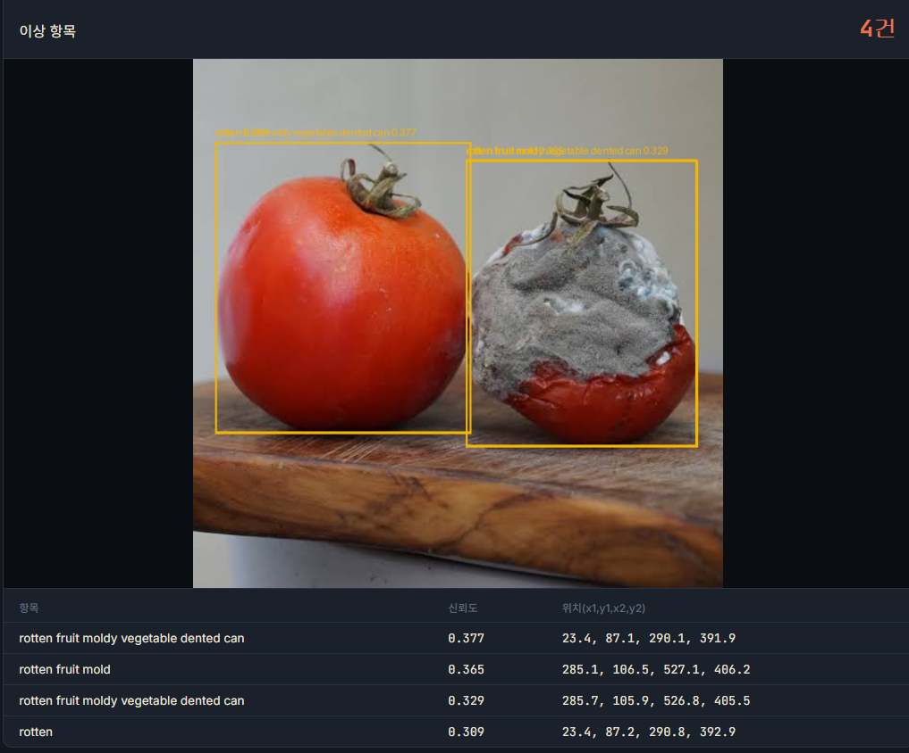
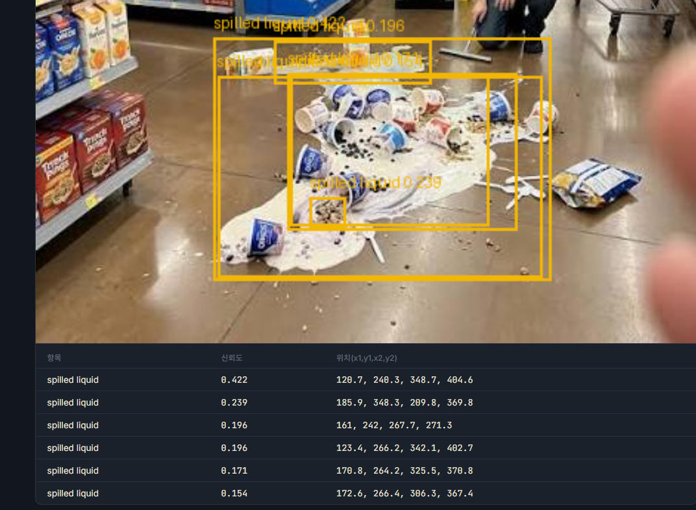
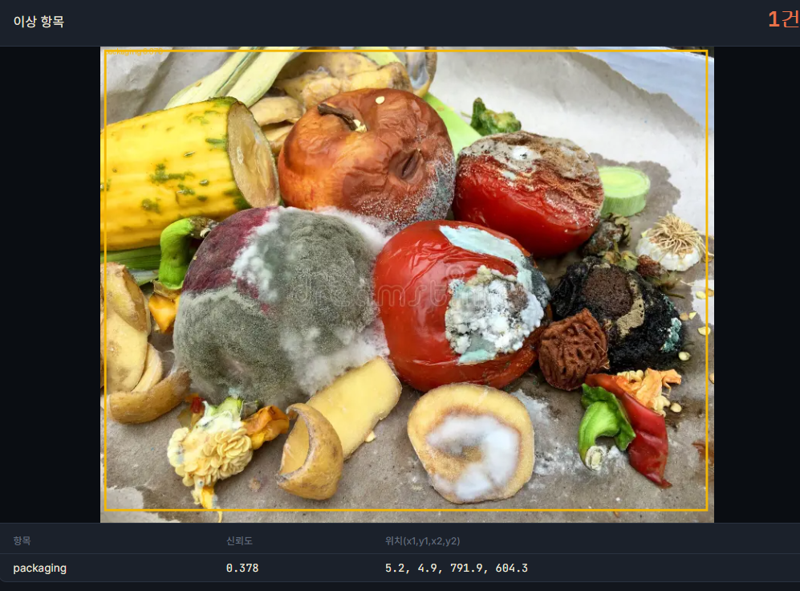
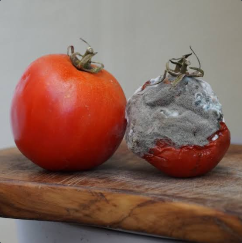
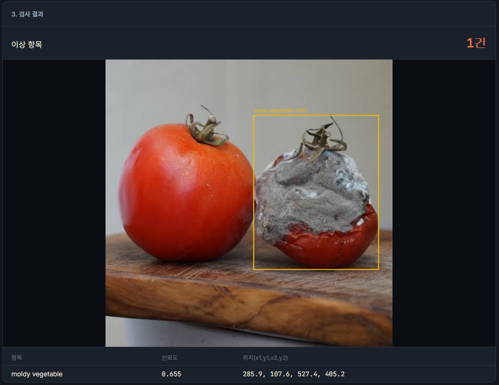
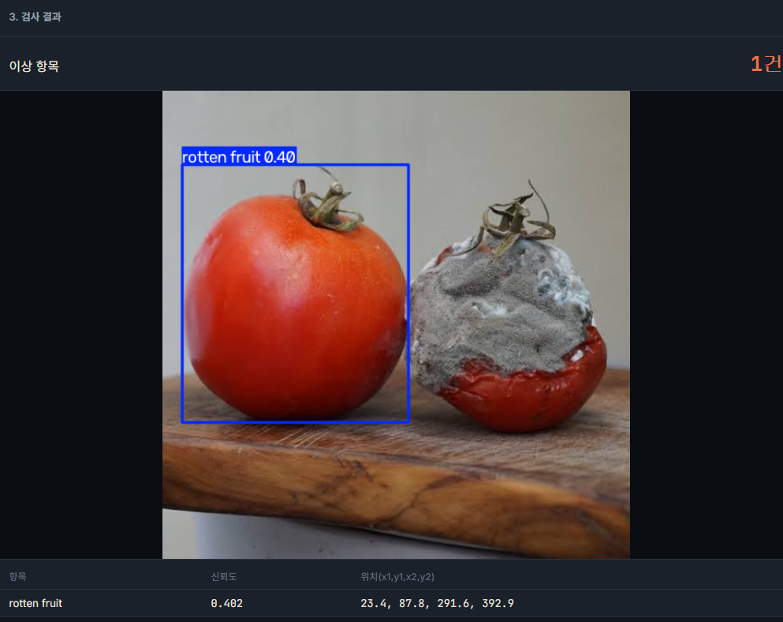

# 상한 걸 놓치지 않았나요? — 냉장 진열대 품질 체크 (Open-Vocabulary Object Detection 비교)

마트/편의점 냉장 진열대 사진을 올리면, **원하는 이상 유형을 프롬프트 문장으로 지정**해 즉석에서 찾아내는 데모입니다. 상한 과일, 곰팡이 핀 채소, 포장 훼손, 찌그러진 캔, 훼손된 라벨, 액체 흘림처럼 흔한 결함 유형을, 재학습 없이 프롬프트만 바꿔서 바로 탐지할 수 있습니다.

같은 UI/UX로, **서로 다른 세 가지 Open-Vocabulary(개방형 어휘) 탐지 모델**을 각각 구현해 비교해볼 수 있도록 만들었습니다. 각 구현의 실행 방법·사용 예시는 [`Requirements_DINO/README.md`](../Requirements_DINO), [`Requirements_YOLO/README.md`](../Requirements_YOLO), [`Requirements_YOLOE/README.md`](../Requirements_YOLOE)를 참고하세요. 여기서는 셋을 비교한 내용만 다룹니다.

| | [`Requirements_DINO/`](../Requirements_DINO) | [`Requirements_YOLO/`](../Requirements_YOLO) | [`Requirements_YOLOE/`](../Requirements_YOLOE) |
|---|---|---|---|
| 모델 | Grounding DINO (`IDEA-Research/grounding-dino-base`) | YOLO-World (`yolov8x-worldv2`) | YOLOE (`yoloe-11l-seg`) |
| 라이브러리 | HuggingFace `transformers` | `ultralytics` | `ultralytics` |
| 방식 | 이미지 + 텍스트 문장을 함께 인코딩해 매칭 영역을 찾는 phrase grounding | 프롬프트를 클래스로 등록(`set_classes`)해 일반 객체탐지처럼 처리하는 OVD | 프롬프트를 텍스트 임베딩(`get_text_pe`)으로 바꿔 클래스로 등록하는 OVD, 원래는 세그멘테이션 모델 |
| 중복 박스 제거(NMS) | 직접 구현 (아래 "겪었던 문제" 참고) | ultralytics 내부에서 자동 처리 | ultralytics 내부에서 자동 처리 |
| 임계값 | `box_threshold`(영역), `text_threshold`(문구 일치도) 2개 | `threshold`(confidence) 1개 | `threshold`(confidence) 1개 |

세 앱 다 독립 실행되는 Flask 서버이고, 포트가 겹치므로(다 5000번) 동시에 켜지 마세요.

## 겪었던 문제와 해결 (Grounding DINO 기준)

실제로 이것저것 테스트해보면서 겪은 문제들과, 왜 이 모델을 이렇게 쓸 수밖에 없었는지 기록해둡니다.

1. **`transformers` 최신 버전에서 API가 바뀜** — `post_process_grounded_object_detection`의 `box_threshold` 파라미터가 v4.55부터 `threshold`로 이름이 바뀌었고, `results["labels"]`는 v4.51부터 문자열이 아니라 정수 id를 반환합니다. 문자열 라벨은 `results["text_labels"]`를 써야 합니다.
2. **여러 프롬프트를 한 문장으로 합치면 라벨이 서로 섞임** — 처음엔 `"rotten fruit. moldy vegetable. damaged packaging. ..."`처럼 프롬프트를 마침표로 이어붙여 한 번에 모델에 넣었는데, 임계값을 낮추면 마침표 경계를 넘어 `"rotten fruit moldy vegetable dented can"`처럼 서로 다른 프롬프트가 하나로 뒤섞인 라벨이 나왔습니다. **해결**: 프롬프트마다 모델을 따로 호출(개별 forward pass)해서 애초에 섞일 수 없게 만들었습니다. 정확도는 좋아지지만 프롬프트 개수만큼 추론 시간이 늘어나는 트레이드오프가 있습니다.

   

3. **같은 물체에 중복 박스가 잡힘** — 임계값을 낮게 잡을수록 같은 영역에 신뢰도가 조금씩 다른 박스가 여러 개 잡혔습니다. `transformers`의 `post_process_grounded_object_detection`은 NMS를 해주지 않아서, IoU 기준으로 겹치는 박스 중 신뢰도가 가장 높은 것만 남기는 class-agnostic NMS를 직접 구현했습니다.

   

4. **사진 전체를 통째로 덮는 오탐 박스** — 배경(포장지, 종이 등)을 잘못 인식해 이미지 전체 크기에 가까운 박스가 잡히는 경우가 있었습니다. 박스 면적이 이미지 전체의 85%를 넘으면 자동으로 걸러내는 필터를 추가했습니다.

   
5. **임계값은 사진마다 다시 맞춰야 함** — 넓게 퍼진 액체 스필처럼 경계가 불분명한 이상 유형은 `box_threshold`를 0.15~0.2까지 낮춰야 겨우 잡히는 반면, 명확한 물체(찌그러진 캔, 곰팡이 핀 채소)는 기본값(0.35) 근처에서도 잘 잡힙니다. 너무 낮추면 정상 물체를 오탐하므로(예: 정상 토마토가 `rotten fruit 0.486`으로 오탐), 대략 0.4~0.55 사이에서 사진을 보며 조절하는 걸 권장합니다.
6. **YOLO-World는 라벨 섞임·중복 박스 문제가 없음** — `model.set_classes(prompts)`로 각 프롬프트를 독립된 클래스로 등록하는 방식이라 애초에 라벨이 섞일 수 없고, ultralytics의 `predict()`가 내부적으로 NMS를 처리해줘서 중복 박스 문제도 없습니다.
7. **(YOLO-World) GPU 환경에서 두 번째 검사부터 크래시** — `YOLOWorld(MODEL_NAME)`만 하고 `.to(device)`를 안 해주면, `set_classes()` 내부의 CLIP 텍스트 인코더가 이미지 백본과 다른 디바이스(CPU/CUDA)에 놓여서 `RuntimeError: Expected all tensors to be on the same device`가 납니다. 신기하게도 **첫 번째 호출은 우연히 성공하고 그다음부터 계속 500 에러**가 나서 처음엔 원인 파악이 헷갈렸습니다. 모델 로드 직후 명시적으로 `model.to(device)`를 호출해서 해결했습니다.
8. **YOLO-World의 모델 크기(정확도)가 생각보다 큰 차이를 만듦** — 아래 "모델별 정확도 비교" 참고.

## 모델별 정확도 비교 (같은 사진, 같은 프롬프트로 실측)

정상 토마토와 곰팡이 핀 토마토 사진 한 장([`docs/images/test-tomatoes.png`](images/test-tomatoes.png))에, 프롬프트 6개(`rotten fruit`, `moldy vegetable`, `damaged packaging`, `dented can`, `torn label`, `spilled liquid`)를 그대로 넣고 임계값을 0.01까지 낮춰서 **각 모델이 두 토마토에 실제로 어떤 신뢰도를 매기는지** 확인했습니다.

| 모델 | 곰팡이 토마토 (정답) | 정상 토마토 (오답이어야 함) | 평가 |
|---|---|---|---|
| Grounding DINO base | **0.655** (`moldy vegetable`) | 0.486 (`rotten fruit`) | 격차가 커서 임계값 0.5~0.55로 확실히 구분됨 |
| YOLO-World s (`yolov8s-worldv2`) | 0.016 (`moldy vegetable`) | 0.036 (`dented can`) | 사실상 이 장면을 인식하지 못함 |
| YOLO-World x (`yolov8x-worldv2`) | 0.413 (`rotten fruit`) | 0.345 (`rotten fruit`) | 정답이 근소하게 높지만 격차가 좁아 임계값을 매우 정밀하게 맞춰야 함 |
| YOLOE 11l (`yoloe-11l-seg`) | 0.251 (`moldy vegetable`) | **0.317** (`rotten fruit`) | 오답이 정답보다 높게 나옴(역전) — 이 과제엔 부적합 |

실제 웹 UI에서 이 표의 수치가 어떻게 나타나는지 비교해보면:

| Grounding DINO base — 곰팡이 토마토만 정확히 탐지 | YOLO-World x — 정상 토마토를 오탐 | YOLOE — 오답이 정답보다 신뢰도가 높음 |
|---|---|---|
|  |  |  |
| `moldy vegetable 0.655` 하나만 잡히고 정상 토마토는 걸러짐 | `rotten fruit 0.40`으로 정상 토마토가 잡히고, 진짜 곰팡이 토마토는 상위 결과에 없음 | 정상 토마토가 `rotten fruit 0.32`, 진짜 곰팡이 토마토는 `moldy vegetable 0.25`로 오답이 더 높게 나옴 |

**결론**: OVD(open-vocabulary detection) 모델도 종류·크기에 따라 "정상과 미세한 이상을 구분하는" 정교함 차이가 상당히 큽니다. 이번 과제(정상 vs 살짝 상한 것 구분)에는 Grounding DINO base가 가장 안정적이었고, YOLO-World는 작은 모델(s)로는 부족해서 큰 모델(x)로 올려야 했으며, 그마저도 DINO만큼 명확한 격차는 아니었습니다. 최신·대형 모델인 YOLOE조차 이 특정 케이스에서는 더 나은 성능을 보장하지 않았습니다 — 모델을 고를 땐 "최신/크다"보다 실제 과제로 직접 검증하는 게 중요하다는 걸 보여주는 사례입니다.

실제로 YOLO-World 앱에서 이 표의 좁은 격차가 어떤 식으로 오탐을 만드는지는 [`Requirements_YOLO/README.md`의 "한계: 정상 물체를 오탐하는 문제"](../Requirements_YOLO#한계-정상-물체를-오탐하는-문제) 스크린샷을 참고하세요.

## 결론 / 사용 팁

- 탐지 결과는 "확정"이 아니라 **사람이 검토할 후보**로 취급하는 게 안전합니다. 신뢰도 0.3~0.5대는 특히 사람이 한 번 더 확인하는 걸 권장합니다.
- 데모용 사진은 배경이 있고 물체 간 구분이 되는, **실제 매장/냉장고 상황을 자연스럽게 찍은 사진**이 스톡 콜라주 사진보다 훨씬 잘 맞습니다.
- 이상 유형이 "찌그러진 캔", "찢어진 라벨"처럼 **덩어리진 물체**일 때 가장 안정적으로 동작합니다. 바닥 전체를 뒤덮는 액체 스필처럼 비정형 영역은 바운딩박스 기반 탐지 자체의 한계라, 세그멘테이션(SAM 등) 접근이 더 적합합니다.
